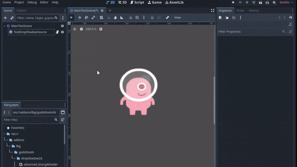

# DropShadow2D – Godot Addon
 

**DropShadow2D** is an easy to use custom node for Godot that adds dynamic 2D drop shadows to sprites.  
It internally uses a second Sprite2D with shader-based blur effect to create various effects, and is packaged as an addon for easy reuse across projects.

---

## Features
- Custom node (`DropShadow2D`) available in the Create Node dialog  
- Adjustable blur radius, strength, color, quality, and more
- Option to have the shadow automatically follow the source sprite

---

## Installation
1. Get the latest release package (or clone the repo).
2. Extract archive at the root of your Godot project. 
You should now have `<project>/addons/lbg/godottools/dropshadow2d/` 
3. In the Godot Editor: go to **Project > Project Settings > Plugins** and enable **DropShadow2D**.  
4. You can now add a **DropShadow2D** node just like any built-in node.

---

## Usage
1. Add a **DropShadow2D** node to your scene.  
2. If you added it directly to a Sprite2D, it will automatically be assigned to it. Otherwise, assign a sparite to the node via the inspector.
3. Adjust properties such as:
   - **Radius**: shadow blur distance  
   - **Strength**: blend intensity  
   - **Color**: tint of the shadow  
   - **Bind Transform**: whether to follow the target’s transform 

Note: If you do not immediately see the shadow in the editor, try saving and reloading the scene or rebooting the editor.

---

## License
This project is licensed under the MIT License – see the [LICENSE](LICENSE) file for details.

---

## Author
Jean-Marie Prévost  
[https://github.com/JeanMariePrevost](https://github.com/JeanMariePrevost)
